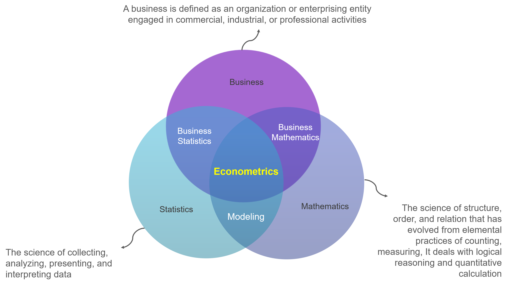
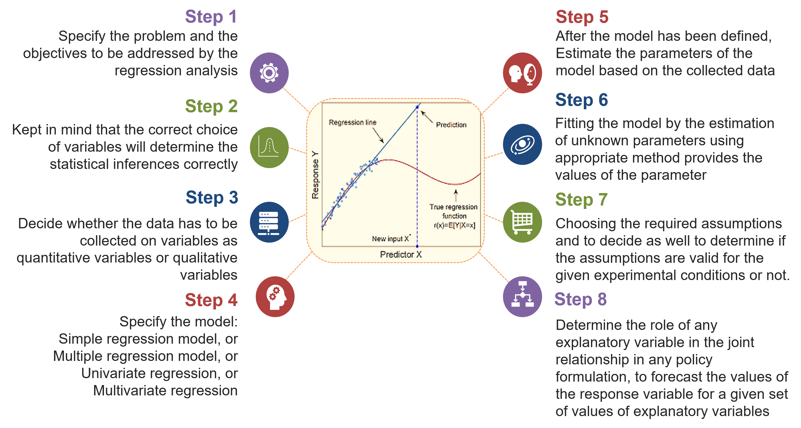

# Introduction to Econometrics

## What is Econometrics?

Econometrics is a branch of economics that combines economic concepts, mathematics, and statistics to analyze and measure empirical relationships in the economy. The term "econometrics" comes from combining the words "economics" and "metrics" (which means measurement). The main goal of econometrics is to develop mathematical models that can be used to explain and predict economic behavior, as well as test economic hypotheses and policies.

```{r econometrics, echo=FALSE,fig.align='center', out.width = '100%'}

```

In practice, econometrics involves applying statistical models to examine relationships between economic variables. By using empirical data, econometricians (econometric practitioners) try to formulate mathematical models that can explain or predict economic behavior in the real world. The main method in econometrics involves statistical regression, in which economic variables are explained and related to each other.

Some basic concepts in econometrics involve:

* **Regression Model:** Create a mathematical model that describes the relationship between the dependent variable and the independent variable.
* **Hypothesis and Statistical Test:** Develop and test hypotheses about relationships between variables, and determine the extent to which analysis results are statistically reliable.
* **Prediction:** Uses an econometric model to predict the value of the dependent variable based on the value of the given independent variable.
* **Economic Policy Evaluation:** Analyze the effects of economic policies using econometric models.

Econometrics has an important role in economic and policy analysis. This allows economists to use empirical data and statistical methods to make more informational and evidence-based decisions in an economic context.

## Goals of Econometrics

The main goal of econometrics is to develop mathematical models that can describe and explain the relationships between economic variables, as well as test economic hypotheses using empirical data. Some specific goals of econometrics involve:

* **Description and Measurement of Economic Relationships:** Econometrics aims to describe and measure the relationships between economic variables. This involves developing a mathematical model that reflects these relationships.
* **Economic Hypothesis Testing:** Econometrics is used to test economic hypotheses, such as whether there is a causal relationship between two variables or whether the effects of an economic policy are significant.
* **Forecasting and Prediction:** Econometrics provides tools for making forecasts and predictions about future economic behavior. By using the developed model, econometricians can estimate the value of the dependent variable based on the value of the given independent variable.
* **Economic Policy Evaluation:** Econometrics is used to evaluate the impact of economic policies. This allows economists to understand how changes in certain economic variables can affect other variables, thereby helping in policy decision making.
* **Understanding of Economic Processes:** Through statistical analysis, econometrics can help in deep understanding of complex economic processes. This includes identifying factors that influence the behavior of consumers, producers, and the market as a whole.
* **Empirical Research:** Econometrics provides tools for economic researchers to test economic theories using empirical data. This can help fill the gap between economic theory and the economic reality that occurs on the ground.
* **Evidence-Based Decision Making:** One of the main goals of econometrics is to provide an empirical basis for decision making in an economic context. By using data and statistical methods, econometrics helps make more informed and evidence-based decisions.

Thus, econometrics has an important role in providing powerful analytical tools for economists to understand and interpret economic phenomena in the real world.


## Econometric Relations and Regression

Regression is a very important analytical tool in econometrics, helping researchers and analysts to measure and understand economic relationships based on empirical data.

* **Use of Regression in Econometrics:** Regression is one of the main tools in econometric analysis. Econometricians use regression techniques to estimate parameters and measure relationships between economic variables.
* **Regression Models in Econometrics:** In the context of econometrics, regression models are often used to describe and understand causal relationships between economic variables. This model can include economic variables such as income, prices, production, and others.
* **Hypothesis Testing in Regression Context:** Econometricians use regression to test economic hypotheses. For example, does an increase in variable A cause an increase or decrease in variable B.
* **Prediction and Forecasting:** Regression analysis is used in econometrics to make predictions and forecasting. By using a regression model, econometricians can estimate the value of the dependent variable based on the value of the independent variable.

```{r regression, echo=FALSE,fig.align='center', out.width = '100%'}

```

## Lab Practicum

### Simple Regression

Suppose you have data on product sales (Y) and advertising costs (X) for several months. Perform a simple regression to understand the relationship between advertising costs and sales. Use the following dataset:

```{r}
# Data
sales <- c(100, 120, 130, 140, 160)
advert <- c(50, 70, 90, 110, 130)

# Simple Regression Model
model1 <- lm(sales ~ advert)

# results
summary(model1)
```

Based on the regression results above, interpret the regression coefficient, R-squared value, and significance test to see whether advertising costs have a significant influence on sales.


### Multiple Regression

Suppose you have a production dataset that includes production (Y), number of hours worked (X1), and number of machines (X2). Perform multiple regression to model the production relationship with these independent variables.


```{r}
# Data
product <- c(200, 250, 300, 280, 320)
work_hours <- c(40, 50, 60, 55, 65)
number_of_machines <- c(2, 3, 4, 3, 5)

# Multiple Regression model
model2 <- lm(product  ~ work_hours + number_of_machines)

# result
summary(model2)
```

Berdasarkan hasil regresi berganda di atas, identifikasi variabel yang memiliki pengaruh signifikan terhadap produksi. Interpretasikan koefisien regresi dan uji signifikan masing-masing variabel.

### Catatan{-}

* Pastikan untuk memberikan penjelasan yang jelas tentang interpretasi hasil, termasuk signifikansi statistik dan koefisien determinasi (R-squared).
* Anda dapat menambahkan visualisasi grafik, seperti plot regresi atau residu, untuk memperjelas analisis.
* Selalu periksa dan pastikan bahwa dataset yang digunakan sesuai dengan konteks soal dan telah diimport dengan benar ke dalam lingkungan R.
