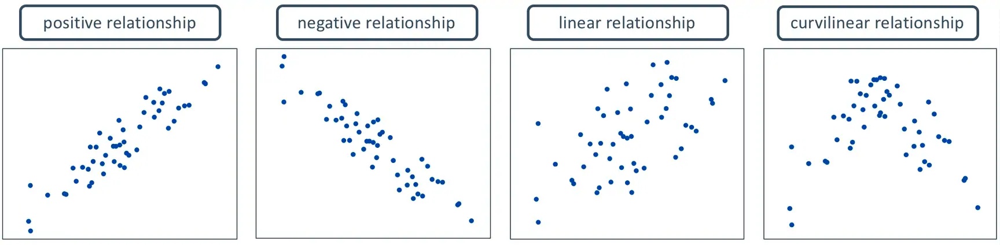
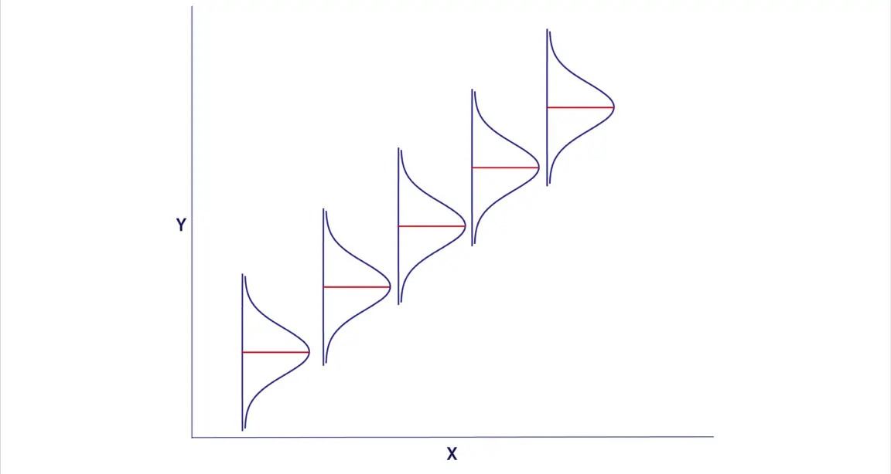

# Simple Regression

## What is Regression?

Regression is a set of statistical methods used for the estimation of relationships between a dependent variable and one or more independent variables. It can be utilized to assess the strength of the relationship between variables by fitting a line to the observed data. Regression allows you to estimate how the dependent variable changes as the independent variable(s) change. There are several variations of Regression, such as linear, multiple linear, and nonlinear.


The most common models are simple linear and multiple linear. Nonlinear regression analysis is commonly used for more complicated data sets in which the dependent and independent variables show a nonlinear relationship.


## Measures Of The Relationship 

There are two quantitative measures of such relationships:

### Covariance

In probability theory and statistics, covariance is a measure of the joint variability of two random variables. 

$$
\begin{aligned}
cov(x,y)={\sum^n_{i=1} (x_i-\bar{x})(y_i-\bar{y}) \over n-1} \\
\end{aligned}
$$

Covariance between two variables:

* $cov(x,y) > 0$, $x$ and $y$ tend to move in the same direction
* $cov(x,y) < 0$, $x$ and $y$ tend to move in opposite directions
* $cov(x,y) = 0$, $x$ and $y$ are independent

### Correlation 

The linear correlation coefficient is also referred to as Pearson’s product moment correlation coefficient in honor of Karl Pearson, who originally developed it. This statistic numerically describes how strong the straight-line or linear relationship is between the two variables and the direction, positive or negative.

We can describe the relationship between these two variables graphically and numerically. In order to measure the strength of a linear relationship between two quantitative variables graphically, we use scatter plots:

<br>

```{r correlation, echo=FALSE,fig.align='center', out.width = '100%'}

```

<br>

If you want to measure the strength of a linear relationship between two quantitative variables numerically, use the following form:

$$
\begin{aligned}
r={cov(x,y)\over s_x s_y}
\end{aligned}
$$

where $s_x$ are the sample mean and sample standard deviation of the $x’s$, and $s_y$ are the mean and standard deviation of the $y’s.$

The properties of “r”:

* It is always between -1 and +1.
* It is a unitless measure so “r” would be the same value whether you measured the two variables in pounds and inches or in grams and centimeters.
* Positive values of “r” are associated with positive relationships.
* Negative values of “r” are associated with negative relationships.

## The General Model

A simple linear regression model assumes that a linear relationship exists between the conditional expectation of two quantitative variables:

```{r linear, echo=FALSE,fig.align='center', out.width = '80%'}

```

where,

* $Y$ is regarded as the predictor, explanatory, or dependent variable.
* $X$ is regarded as the response, outcome, or independent variable.
* $\beta_1$  is the intercept parameter or coefficient
* $\beta_2$  is the slope parameter or coefficient
* $\hat{Y}$ is the estimated value of $Y$ given $X$
* $b_1$ and $b_2$ is the coefficient estimated value 


### SLR: The Mathematical Model

The mathematical representation of a simple linear regression model a model with one dependent variable and only one independent variable can be expressed as: 

$$
\begin{aligned}
E(y|x)=\mu_y|x=\beta_1+β_2x
\end{aligned}
$$

where $\beta_1$ and $\beta_2$ are the regression parameters that represent the intercept and slope, respectively. We can interpret the above equation as, “The expected value of the depepndent variable $y$ given $x$ is equal to the mean of $y$ given $x.$” The expected value of $y$ given $x,$ according to the equation 3, can be mathematically represented with an intercept $\beta_1$ and a coefficient of $x, \beta_2.$ The conditional mean $E(y|x)$ is called a simple linear regression model because it contains only one non-random independent variable $x.$


### SLR: The Statistical Model

The simple linear regression model relies on a few assumptions. First, if $var(y|x)=\sigma^2,$ then the data is said to be homoscedastic. This means that for any value of $x,$ the variance of $y$ remains the same. However, this is an unrealistic assumption in real life. Most “real world data” that you would be working with will be heteroscedastic, which means that the variance does not remain the same for a given value of $x.$ The issue of heteroscedasticity is not such a grave sin, depending on the objective and if you have a large enough sample size. However, overcoming this issue is not within the scope of this tutorial. It is just one of the assumptions of the simple linear regression model.

The five assumptions of the simple linear regression model are:

* The mean value of $y$ for each value of $x$ is given by the regression function $E(y|x)=\mu y|x=\beta_1+\beta_2x.$
* For each value of $x,$ the values of $y$ are distributed about their mean value, following the probability distribution that all have the same variance (i.e. homoscedasticity). That is, $var(y|x)=\sigma^2.$
* The sample values of $y$ are all uncorrelated and have zero covariance, which implies that no linear association exists between them. That is, $cov(y_i,y_j)=0.$
* The value $x$ is not random and must take at least two values.
* (Optional) The values of $y$ follow a Gaussian Distribution (i.e. normally distributed about their mean for each value of $x$). This means that $y∼N[\beta_1+\beta_2x,\sigma^2]$


### The Least Squares Principle

The goal in simple linear regression is to estimate the parameters (the $\beta’s$). To do so, we must first introduce the least squares principle, the method we will use to estimate these parameters. The **least squares principle** states that the “line of best fit” is the one that minimizes the distance between each point $(x,y)$ to the regression line. In terms of notation, the parameter estimates of $\beta_1$ and $\beta_2$ are generally denoted as $_1$ and $b_2$, respectively.

The equation for the line of best fit is given by

$$
\begin{aligned}
\hat{y}_i=b_1+b_2x_i
\end{aligned}
$$

The vertical distances between the line of best fit and each point $(x,y)$ are referred to as the **least squares residuals**, which is given by

$$
\begin{aligned}
\hat{e}_i=y_i−\hat{y}_i=y_i−b_1+b_2x_i
\end{aligned}
$$

In order to find the values for $b_1$ and $b_2,$ we want to find the values for the unknown parameters $\beta_1$ and $\beta_2$ that minimizes the sum of squares function

$$
\begin{aligned}
S(\beta_1,\beta_2)=\sum_{i=1}^N e^2_i= \biggl(y_i−\beta_1+\beta_2x_i \biggr) ^2
\end{aligned}
$$

The **least squares estimator** $b_1$ and $b_2$ can be solved using the following equations

$$
\begin{aligned}
b_2 & = {\sum^N_{i=1}(x_i−\bar{x})(y_i−\bar{y}) \over \sum^N_{i=1}(x_i−\bar{x})^2 }\\
b_1& = \bar{y}−b_2\bar{x}
\end{aligned}
$$

### Least Squares Estimators

It is important to note that we may never know the true value of $\beta_1$ and $\beta_2,$ and consequently may never know whether our estimates $b_1$ and $b_2$ are close to the actual values. The least squares estimates $\hat{y_i}$ are random variables because they depend on the random variable $y.$ However, if all of our assumptions hold, then $E(b_2)=\beta_2$. In a situation where the estimators are equal to their true parameter values, then they are said to be unbiased estimators. If we have a large sample size $N$ and all of the assumptions for the simple linear regression model hold, then the value of the estimators $b_1$ and $b_2$ obtained from all the samples will be $\beta_1$ and $\beta_2,$ respectively. The unbiasedness property depends on having many samples of data from the same population.

If all of the assuptions of the linear regression model hold, then the variances and covariances of the estimators are

$$
\begin{aligned}
var(b_1) & =\sigma^2 \biggl[{\sum^n_{i=1}x^2_i \over N(x_i−\bar{x})^2}\biggl] \\
var(b_2) & ={\sigma^2 \over \sum(x_i−\bar{x})^2}  \\
cov(b_1,b_2) & =\sigma^2 \biggl[{−\bar{x} \over ∑^n_{i=1}(x_i−\bar{x})^2}\biggr] \\
\end{aligned}
$$

The variance of an estimator measures the precision of the estimator in the sense that it tells us how much the estimates can vary from sample to sample. ***The smaller the variance, the greater the sampling precision***. Then the Gauss-Markov Theorem states that the estimators $b_1$ and $b_2$ have the smallest variance of all linear and unbiased estimators of $\beta_1$ and $\beta_2.$ Such estimators are commonly referred to as the best linear unbiased estimator (BLUE).


### Estimate the Var and Cov 

Recall that the variance of the random error term $e$ is

$$
\begin{aligned}
var(e_i)=E\biggl[e_i−E(e_i)\biggr]^2
\end{aligned}
$$

If the assumption $E(e_i)=0.$ If the assumption holds, we can then rewrite the variance of the random error term $e$ as

$$
\begin{aligned}
var(e_i)=\sigma^2=E[e_i]^2={1\over N} \sum_{i=1}^N e^2_i
\end{aligned}
$$

Unfortunately, the above formula is of little to no use since the random error term $e_i$ is unobservable. Fortunately, since $e_i=y_i−E(y|x)=y_i−\beta1+\beta_2x_i,$ we can replace the unknown parameters $\beta_1$ and $\beta_2$ with their least squares estimates $b_1$ and $b_2$ to obtain

$$
\begin{aligned}
\hat{e}_i=y_i−\hat{y}_i=y_i−b_1+b_2x_i
\end{aligned}
$$

The unbiased estimator of the variance of the random error term is

$$
\begin{aligned}
\sigma^2={\sum \hat{e}_i \over N−2}
\end{aligned}
$$

where 2 represents the number of parameters (in this case $\beta_1$ and $\beta_2$). We refer to this as having $N−2$ degrees of freedom. Now that we have an unbiased estimator of the variance of our random error term $e,$ we can estimate the variances and covarianes of their least squares estimates.

$$
\begin{aligned}
\widehat{var(b_1)} & = \hat{\sigma^2} \biggl[{\sum^n_{i=1}x^2_i \over N(x_i−\bar{x})^2}\biggl] \\
\widehat{var(b_2)} & ={\hat{\sigma^2} \over \sum(x_i−\bar{x})^2}  \\
\widehat{cov(b_1,b_2)} & = \hat{\sigma^2} \biggl[{−\bar{x} \over ∑^n_{i=1}(x_i−\bar{x})^2}\biggr] \\
\end{aligned}
$$


## Lab Practicum

The data for this example is stored in the R package `PoEdata`. First, you have to install the "PoEdata" package, type the following script lines in the Console window of RStudio:


```{r library, eval=FALSE}
# install.packages("remotes")
# remotes::install_github("ccolonescu/PoEdata")
```

Then, consider the data set:

```{r, message=FALSE}
library(PoEdata)                                     # load the library PoEdata
library(DT)                                          # use for datatable fuction 
data("food", package="PoEdata")
datatable(food)
```

It is always a good idea to visually inspect the data in a scatter diagram, which can be created using the function `plot()`. The figure bellow is a scatter diagram of food expenditure on income, suggesting that there is a positive relationship between income and food expenditure.


```{r}
plot(food$income, food$food_exp, 
     ylim=c(0, max(food$food_exp)),
     xlim=c(0, max(food$income)),
     xlab="weekly income in $100", 
     ylab="weekly food expenditure in $", 
     type = "p")
```

[About $R^2$](https://www.investopedia.com/terms/r/r-squared.asp)

### Estimating a Linear Regression

For the food expenditure data, the regression model will be

$$
\begin{aligned}
Y&=\beta_1+\beta_2 *X+e \\
food_{exp}&=\beta_1+\beta_2*income+e
\end{aligned}
$$

The R function for estimating a linear regression model is `lm(y~x, data)` which, used just by itself does not show any output; It is useful to give the model a name, such as `mod1`, then show the results using `summary(mod1)`. 

```{r}
mod1 <- lm(food_exp ~ income, data = food)           # linear model
smod1<- summary(mod1)                                # get summary 
smod1
```

If you are interested in only some of the results of the regression, such as the estimated coefficients, you can retrieve them using specific functions, such as the function `coef()`.

```{r}
b1 <- coef(mod1)[[1]]                                # the estimated value of  β1
b2 <- coef(mod1)[[2]]                                # the estimated value of  β2
b1
b2
```

From the result, we can write our estimating linear regression as:

$$
\begin{aligned}
\hat{Y}&=b_1+b_2*X \\
\hat{food_{exp}}&=83.416+10.20964*income
\end{aligned}
$$

The intercept parameter, $\beta_1$ , is usually of little importance in econometric models; we are mostly interested in the slope parameter,  $\beta_2$.  The estimated value of  $\beta_2$  suggests that the food expenditure for an average family increases by 10.209643 when the family income increases by 1 unit, which in this case is \$100. The  R  function `abline()` adds the `regfression` line to the previously plotted scatter diagram bellow:

```{r}
plot(food$income, food$food_exp, 
     xlab="weekly income in $100", 
     ylab="weekly food expenditure in $", 
     type = "p")
abline(b1,b2)
```

How can one retrieve various regression results? To retrieve a particular result you just refer to it with the name of the object, followed by the \$ sign and the name of the result you wish to retrieve. For instance, if we want the vector of coefficients from `mod1`, we refer to it as `mod1\$coefficients` and `smod1\$coefficients`:

```{r}
mod1$coefficients
```

```{r}
smod1$coefficients
```

```{r,eval=F}
names(mod1)                                          # for more
names(smod1)                                         # for more
```


As we have seen before, however, some of these results can be retrieved using specific functions, such as `coef(mod1), resid(mod1), fitted(mod1), and vcov(mod1)`.

***

### Prediction with SLR Model

The estimated regression parameters,  $b_1$  and  $b_2$  allow us to predict the expected food expenditure for any given income. All we need to do is to plug the estimated parameter values and the given income into an equation like Equation  15 . For example, the expected value of  `food_exp`  for an income of \$2000 is calculated in Equation  16 . (Remember to divide the income by 100, since the data for the variable  income  is in hundreds of dollars.)


$$
\begin{aligned}
\hat{food_{exp}}&=83.416+10.20964*20\\
& = $ 287.608861
\end{aligned}
$$

R, however, does this calculations for us with its function called `predict()`. Let us extend slightly the example to more than one income for which we predict food expenditure, say income = \$2000, \$2500, and \$2700. The function `predict()` in R requires that the new values of the independent variables be organized under a particular form, called a data frame. Even when we only want to predict for one income, we need the same data-frame structure. In R, a set of numbers is held together using the structure `c()`. The following sequence shows this example.

```{r}
mod1 <- lm(food_exp~income, data=food)
newx <- data.frame(income = c(20, 25, 27))
yhat <- predict(mod1, newx)
yhat                                                 # prints the result
```

***

### Assess Regression Coefficients

The regression coefficients  $b_1$  and  $b_2$  are random variables, because they depend on sample. In this case, we repeated samples to assess regression coefficients. Let us construct a number of random subsamples from the food data and re-calculate  $b_1$  and  $b_2$ . A random subsample can be constructed using the function `sample()`, as the following example illustrates only for  $b_2$.

```{r}
N <- nrow(food)   # returns the number of observations in the dataset
C <- 50           # desired number of subsamples
S <- 38           # desired sample size

sumb2 <- 0
for (i in 1:C){   # a loop over the number of subsamples
  set.seed(3*i)   # a different seed for each subsample  
  subsample <- food[sample(1:N, size=S, replace=TRUE), ]
  mod2 <- lm(food_exp~income, data=subsample)
  #sum b2 for all subsamples:
  sumb2 <- sumb2 + coef(mod2)[[2]]
}
print(sumb2/C, digits = 3)
```

The result,  $b_2=9.88$, is the average of 50 estimates of  $b_2$.

***

### Estimated Var and Cov

Many applications require estimates of the variances and covariances of the regression coefficients. R stores them in the a matrix `vcov()`:

```{r}
(varb1 <- vcov(mod1)[1, 1])
(varb2 <- vcov(mod1)[2, 2])
(covb1b2 <- vcov(mod1)[1,2])
```

### Non-Linear Relationships

Sometimes the scatter plot diagram or some theoretical consideraions suggest a non-linear relationship. The most popular non-linear relationships involve logarithms of the dependent or independent variables and polinomial functions. The quadratic model requires the square of the independent variable.


$$
\begin{aligned}
Y=\beta_1+\beta_2*X^2+e\\
\end{aligned}
$$
In R, independent variables involving mathematical operators can be included in a regression equation with the function `I()`. The following example uses the dataset br from the package `PoEdata`, which includes the sale prices and the attributes of 1080 houses in Baton Rouge, LA. price is the sale price in dollars, and sqft is the surface area in square feet.

```{r}
data(br)
mod2 <- lm(price~I(sqft^2), data=br)
b1 <- coef(mod2)[[1]]
b2 <- coef(mod2)[[2]]
sqftx=c(2000, 4000, 6000)            # given values for sqft
pricex=b1+b2*sqftx^2                 # prices corresponding to given sqft 
DpriceDsqft <- 2*b2*sqftx            # marginal effect of sqft on price
elasticity=DpriceDsqft*sqftx/pricex 
b1; b2; DpriceDsqft; elasticity      # prints results
```

We woud like now to draw a scatter diagram and see how the quadratic function fits the data. The next chunk of code provides two alternatives for constructing such a graph. The first simply draws the quadratic function on the scatter diagram, using the R function `curve()`; the second uses the function lines, which requires ordering the data set in increasing values of `sqft` before the regression model is evaluated, such that the resulting fitted values will also come out in the same order.

```{r}
plot(br$sqft, br$price, xlab="Total square feet", 
     ylab="Sale price, $", col="grey")
#add the quadratic curve to the scatter plot:
curve(b1+b2*x^2, col="red", add=TRUE) 
```

An alternative way to draw the fitted curve:


```{r, eval=F}
ordat <- br[order(br$sqft), ] #sorts the dataset after `sqft`
mod2 <- lm(price~I(sqft^2), data=ordat)
plot(br$sqft, br$price, 
     main="Dataset ordered after 'sqft' ", 
     xlab="Total square feet", 
     ylab="Sale price, $", col="grey")
lines(fitted(mod31)~ordat$sqft, col="red")
```

The log-linear model regresses the log of the dependent variable on a linear expression of the independent variable (unless otherwise specified, the log notation stands for natural logarithm, following a usual convention in economics):

$$
\begin{aligned}
Log(Y)=\beta_1+\beta_2*X+e\\
\end{aligned}
$$

One of the reasons to use the log of an independent variable is to make its distribution closer to the normal distribution. Let us draw the histograms of price and log(price) to compare them

```{r}
hist(br$price, col='grey')
hist(log(br$price), col='grey')
```

We are interested, as before, in the estimates of the coefficients and their interpretation, in the fitted values of price, and in the marginal effect of an increase in sqft on price.

```{r}
mod3 <- lm(log(price)~sqft, data=br)
mod3$coefficients
```


The coefficients are  $b_1=   10.84$  and  $b_2=   0.00041$, showing that an increase in the surface area (sqft) of an apartment by one unit (1 sqft) increases the price of the apartment by  0.041  percent. Thus, for a house price of \$100,000, an increase of 100 sqft will increase the price by approximately  100∗0.041  percent, which is equal to \$4112.7. In general, the marginal effect of an increase in $X$  on  $Y$  in Equation  19  is


$$
\begin{aligned}
{dy\over dx}=\beta_2 * Y
\end{aligned}
$$

and the elasticity is


$$
\begin{aligned}
e= {dy\over dx} {X\over Y}=\beta_2 * X
\end{aligned}
$$

The next lines of code show how to draw the fitted values curve of the loglinear model and how to calculate the marginal effect and the elasticity for the median price in the dataset. The fitted values are here calculated using the formula

$$
\begin{aligned}
\hat{Y}= e^{b_1+b_2*X}
\end{aligned}
$$

```{r}
ordat <- br[order(br$sqft), ] #order the dataset
mod4 <- lm(log(price)~sqft, data=ordat)
plot(br$sqft, br$price, col="grey")
lines(exp(fitted(mod4))~ordat$sqft, 
      col="blue", main="Log-linear Model")
```

```{r}
pricex<- median(br$price)
sqftx <- (log(pricex)-coef(mod4)[[1]])/coef(mod4)[[2]]
(DyDx <- pricex*coef(mod4)[[2]])
```

```{r}
(elasticity <- sqftx*coef(mod4)[[2]])
```

R allows us to calculate the same quantities for several (sqft, price) pairs at a time, as shown in the following sequence:


```{r}
b1 <- coef(mod4)[[1]]
b2 <- coef(mod4)[[2]]
#pick a few values for sqft:
sqftx <- c(2000, 3000, 4000) 
#estimate prices for those and add one more:
pricex <- c(100000, exp(b1+b2*sqftx)) 
#re-calculate sqft for all prices:
sqftx <- (log(pricex)-b1)/b2 
#calculate and print elasticities:
(elasticities <- b2*sqftx) 
```
***

### Indicator Variables

An indicator, or binary variable marks the presence or the absence of some attribute of the observational unit, such as gender or race if the observational unit is an individual, or location if the observational unit is a house. In the dataset `utown`, the variable `utown` is  1  if a house is close to the university and  0  otherwise. Here is a simple linear regression model that involves the variable u`town`:

$$
\begin{align}
price_i= \beta_1+\beta_2*utwon_i
\end{align}
$$

The coefficient of such a variable in a simple linear model is equal to the difference between the average prices of the two categories; the intercept coefficient of the model in Equation 22 is equal to the average price of the houses that are not close to university. Let us first calculate the average prices for each category, wich are denoted in the following sequence of code `price0bar` and `price1bar`:


```{r}
data(utown)
price0bar <- mean(utown$price[which(utown$utown==0)])
price1bar <- mean(utown$price[which(utown$utown==1)])
```

The results are: $\bar{price}=$ `r price1bar` close to university, and  $\bar{price}=$ `r price0bar`for those not close. I now show that the same results yield the coefficients of the regression model in Equation 22:

```{r}
mod4 <- lm(price~utown, data=utown)
b1 <- coef(mod4)[[1]] 
b2 <- coef(mod4)[[2]]
b1
b2
```

The results are:  $\bar{price}=b_1=$ `r b1` for non-university houses, and  $\bar{price}=b_1+b_2=$ `r b1+b2` for university houses.


### Monte Carlo Simulation

A Monte Carlo simulation generates random values for the dependent variable when the regression coefficients and the distribution of the random term are given. The following example seeks to determine the distribution of the independent variable in the food expenditure model in Equation 2,

```{r}
N <- 40
x1 <- 10
x2 <- 20
b1 <- 100
b2 <- 10
mu <- 0
sig2e <- 2500
sde <- sqrt(sig2e)
yhat1 <- b1+b2*x1
yhat2 <- b1+b2*x2
curve(dnorm(x, mean=yhat1, sd=sde), 0, 500, col="blue")
curve(dnorm(x, yhat2, sde), 0,500, add=TRUE, col="red")
abline(v=yhat1, col="blue", lty=2)
abline(v=yhat2, col="red", lty=2)
legend("topright", legend=c("f(y|x=10)", 
                            "f(y|x=20)"), lty=1,
       col=c("blue", "red"))
```

Next, we calculate the variance of  $b_2$  and plot the corresponding density function.

$$
\begin{align}
var(b_2)={\sigma^2 \over \sum(x_i−\bar{x})}
\end{align}
$$

```{r}
x <- c(rep(x1, N/2), rep(x2,N/2))
xbar <- mean(x)
sumx2 <- sum((x-xbar)^2)
varb2 <- sig2e/sumx2
sdb2 <- sqrt(varb2)
leftlim <- b2-3*sdb2
rightlim <- b2+3*sdb2
curve(dnorm(x, mean=b2, sd=sdb2), leftlim, rightlim)
abline(v=b2, lty=2)
```

Now, with the same values of  $b_1$ ,  $b_2$ , and error standard deviation, we can generate a set of values for  $Y$ , regress  $Y$  on  $X$ , and calculate an estimated values for the coefficient  $b_2$  and its standard error.

```{r}
set.seed(12345)
y <- b1+b2*x+rnorm(N, mean=0, sd=sde)
mod6 <- lm(y~x)
b1hat <- coef(mod6)[[1]]
b2hat <- coef(mod6)[[2]]
mod6summary <- summary(mod6) #the summary contains the standard errors
seb2hat <- coef(mod6summary)[2,2]
```

The results are  $b_2=11.64$ and  $s_e(b_2)=1.64$. The strength of a Monte Carlo simulation is, however, the possibility of repeating the estimation of the regression parameters for a large number of automatically generated samples. Thus, we can obtain a large number of values for a parameter, say  $b_2$ , and then determine its sampling characteristics. For instance, if the mean of these values is close to the initially asumed value  $b_2=  10$, we conclude that our estimator (the method of estimating the parameter) is unbiased.


We are going to use this time the values of  $X$  in the food dataset, and generate  $Y$  using the linear model with  $b_1=100$ and  $b_2= 10.$

```{r}
data("food")
N <- 40
sde <- 50
x <- food$income
nrsim <- 1000
b1 <- 100
b2 <- 10
vb2 <- numeric(nrsim) #stores the estimates of b2
for (i in 1:nrsim){
  set.seed(12345+10*i)
  y <- b1+b2*x+rnorm(N, mean=0, sd=sde)
  mod7 <- lm(y~x)
  vb2[i] <- coef(mod7)[[2]]
}
mb2 <- mean(vb2)
seb2 <- sd(vb2)
```

The mean and standard deviation of the estimated 40 values of  $b_2$  are, respectively, 9.974985 and 1.152632. Figure bellow shows the simulated distribution of  $b_2$  and the theoretical one.


```{r}
plot(density(vb2))
curve(dnorm(x, mb2, seb2), col="red", add=TRUE)
legend("topright", legend=c("true", "simulated"), 
       lty=1, col=c("red", "black"))
hist(vb2, prob=TRUE, ylim=c(0,.4))
curve(dnorm(x, mean=mb2, sd=seb2), col="red", add=TRUE)
```

```{r}
rm(list=ls()) # Caution: this clears the Environment
```
